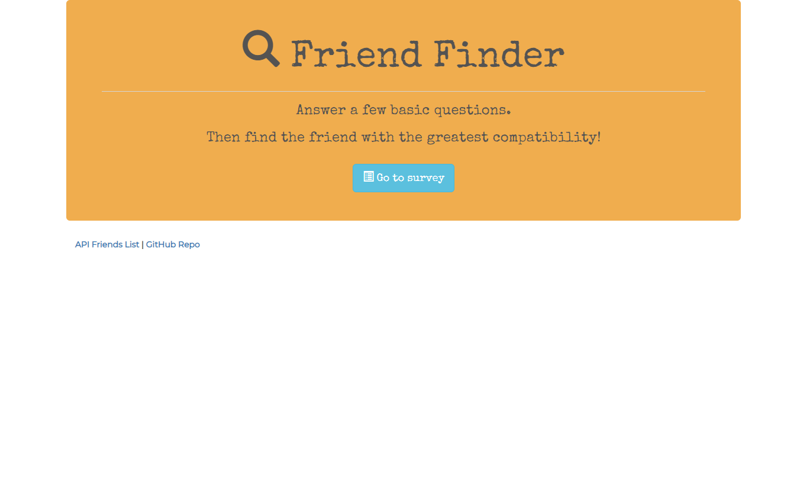
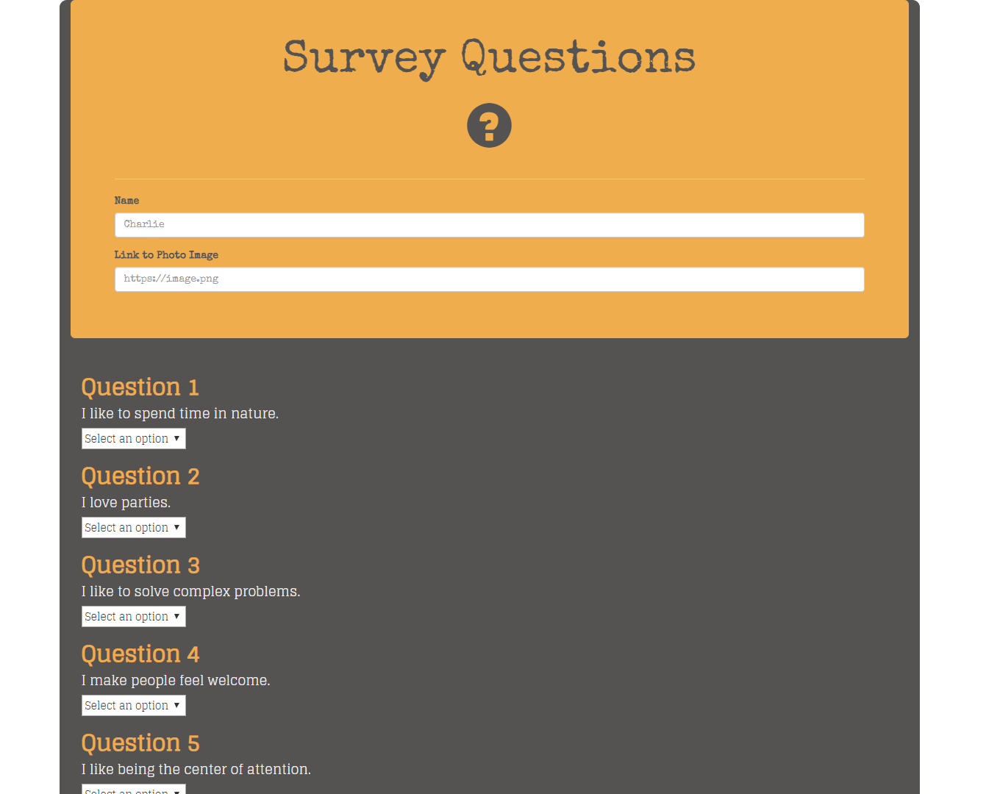
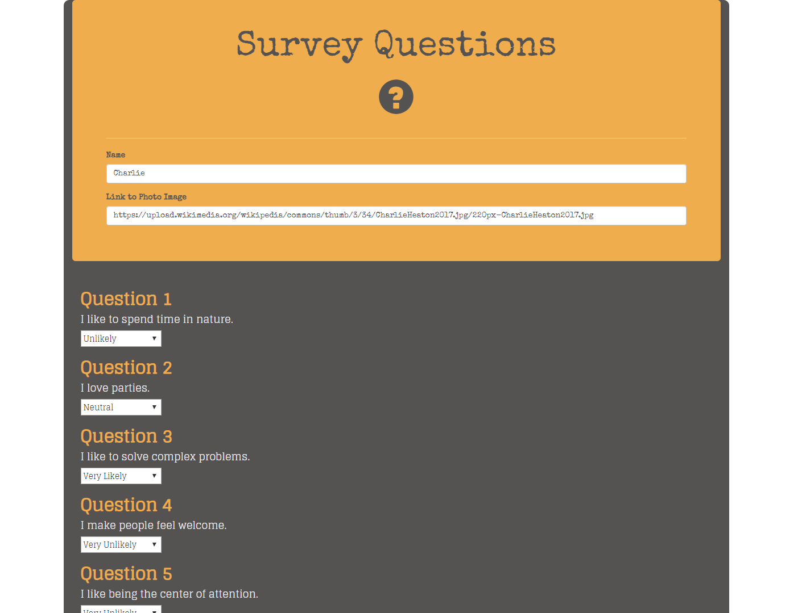
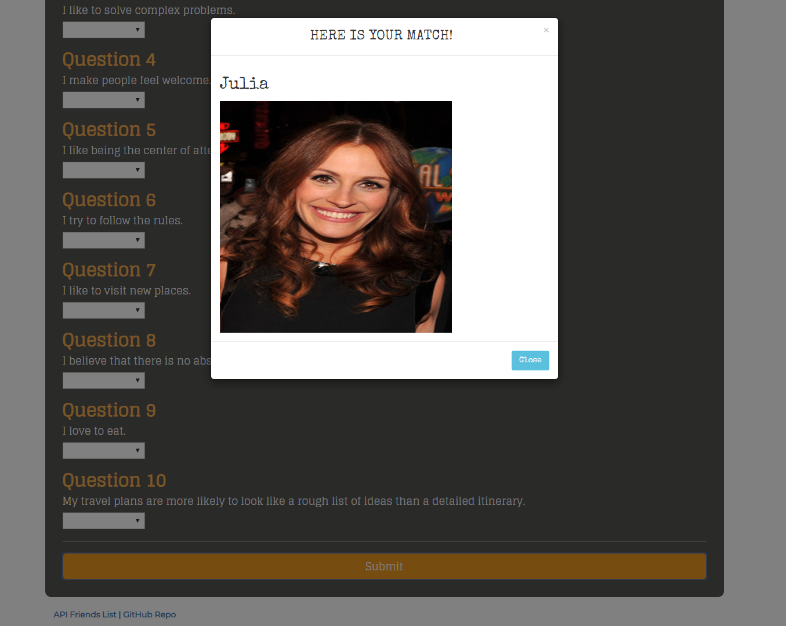

# FriendFinder
---------------
## Table of Contents
1. [Abstract](#abstract)
2. [Coding Overview](#overview)
3. [Application Display](#display)

## Abstract
Friend Finder is a compatibility-based application. The app is basically a dating app. This full-stack site will take in results from users' surveys, then compare their answers with those from other users. The app will then display the name and picture of the user with the best overall match.

Here is the link of the application : https://friendfinder-pnr.herokuapp.com/

## Coding Overview

The application is built with;

* JavaScript
* jQuery
* Node.js
* npm packages
* Express
* Heroku
* HTML
* Bootstrap

## Application Display

 

 

 
